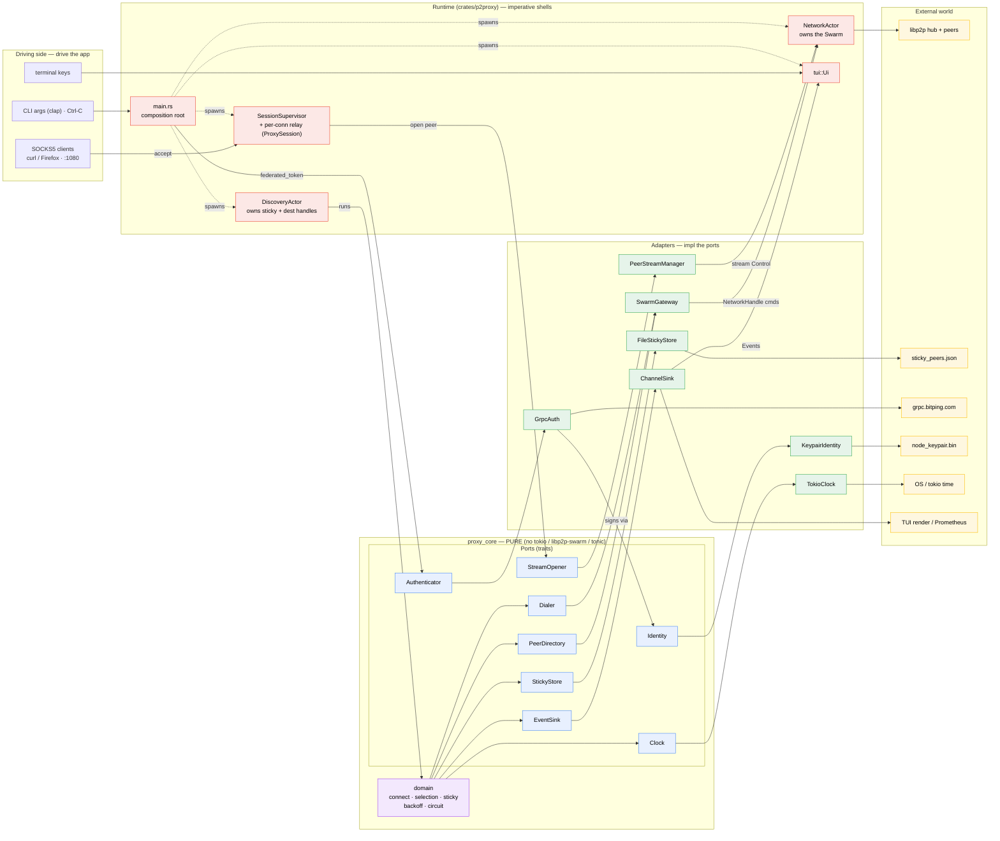

# p2proxy architecture

p2proxy is a **hexagonal (ports-and-adapters)** application. The decision logic
lives in a pure core crate (`crates/core`, package `proxy_core`) that depends on
**no** I/O — no `tokio` runtime, no `libp2p-swarm`, no `tonic`. Everything
concrete (the libp2p swarm, the hub gRPC, the on-disk keypair/sticky store, the
clock, the TUI) is an **adapter** living in the binary crate (`crates/p2proxy`)
behind a **port** (a trait the core defines). Dependencies point inward; the
crate boundary enforces it (the core literally can't reference the outside).

Two stateful **shells** (actors) own the things that must be single-owner — the
libp2p `Swarm` and the sticky/affinity state — and drive the pure core through
the ports. The data plane (accepting SOCKS connections and copying bytes) is a
task per connection, deliberately *not* an actor.

## Diagram

## Ports and adapters

| Port (trait, `core::ports`) | Adapter (`p2proxy::adapters` / `runtime`) | Backs onto | Driven by |
|---|---|---|---|
| `PeerDirectory` | `SwarmGateway` | `NetworkHandle` → `NetworkActor` → Swarm (hub FindNodes / resolve) | `DiscoveryActor` (`connect`) |
| `Dialer` | `SwarmGateway` | same → Swarm dial of peers / relays | `DiscoveryActor` (`connect`) |
| `StreamOpener` | `PeerStreamManager` | libp2p stream `Control` → exit peer (per-peer semaphores) | session relay tasks |
| `StickyStore` | `FileStickyStore` (wraps pure `StickyState`) | `sticky_peers.json` (atomic write) | `DiscoveryActor` (`connect`) |
| `Authenticator` | `GrpcAuth` | tonic → `grpc.bitping.com` | `main` at startup |
| `Identity` | `KeypairIdentity` | `node_keypair.bin` (Ed25519) | `GrpcAuth` signing, bootstrap |
| `Clock` | `TokioClock` | OS / tokio time | `connect` backoff, the drivers |
| `EventSink` | `ChannelSink` | mpsc → TUI reducer / Prometheus | everywhere (`emit`) |
| `Actor` | `NetworkActor`, `DiscoveryActor` | the runtime drivers (`drive` / `drive_network`) | `Runtime::spawn` |

### Driving vs driven
- **Driving (primary):** SOCKS5 clients, the CLI/Ctrl-C, the TUI keyboard. They call *into* the app.
- **Driven (secondary):** everything in the table. The core calls *out* through a port it owns; the adapter implements it (dependency inverted).
- The **network edge is two-deep:** `PeerDirectory`/`Dialer` (`SwarmGateway`) and `StreamOpener` (`PeerStreamManager`) don't each own a swarm — they both funnel into the single `NetworkActor` that does.
- `EventSink` is the one port that flows back out to a driving adapter: the app emits `Events`, `ChannelSink` pushes them over mpsc, the TUI renders.

### The two actors (and why only two)
Only `NetworkActor` and `DiscoveryActor` implement `Actor`. They exist to serialize access to single-owner mutable state (the `Swarm`; the sticky store + per-port destination `ArcSwap`s) without locks. `NetworkActor` uses a bespoke `drive_network` loop because it owns an event *source* (the swarm); `DiscoveryActor` uses the generic `drive`. The accept loops, per-connection relay tasks, and `PeerStreamManager` are intentionally **not** actors — they're streaming/shared-resource shaped, not message-handler shaped.

## Adding a new adapter (the living-doc bit)

Swapping or adding an integration is a one-file change plus a wiring line — you should never touch `core::domain`:

1. **New backend for an existing port** (e.g. a different sticky store): add a struct in `crates/p2proxy/src/adapters/`, `impl <ThePort> for <YourAdapter>`, and swap it in at the composition root in `main.rs` (the `AppContext`/`Runtime::spawn` wiring). The domain is generic over the trait, so nothing else changes. Add a fake in `core::testing::fakes` if it's worth testing the domain against.
2. **New boundary** (a genuinely new kind of dependency, with ≥2 real or real+fake implementations): define the trait in `crates/core/src/ports/`, make the relevant `domain` code generic over it, then add the production adapter in the binary and wire it. Don't add a port that has exactly one impl and exists only for test injection — test the concrete type with an in-memory dependency instead (see `PeerStreamManager`, tested against a `MemoryTransport` swarm).

Rule of thumb: a port earns its place when there's something to *adapt* (a real backend plus at least a fake, or genuine swap value). Otherwise keep the concrete type — the crate boundary already gives you most of the isolation.
